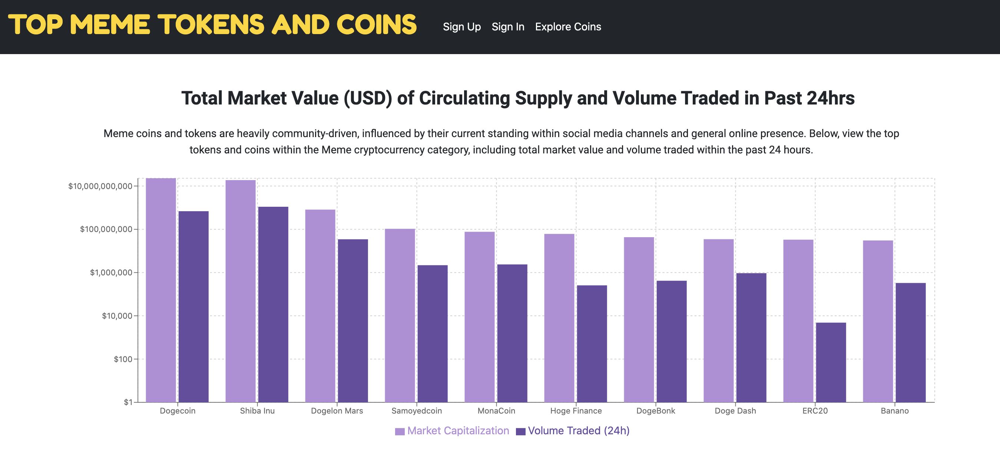

# Top Meme Tokens and Coins

### An entire category of cryptocurrency is inspired by memes, and it's worth billions of US dollars: Meme coins and tokens are heavily community-driven, influenced by their current standing within social media channels and general online presence.
This is a web application which allows users to view the top tokens and coins within the Meme cryptocurrency category, including total market value and volume traded within the past 24 hours. Data is from the [CoinMarketCap API](https://coinmarketcap.com/api/documentation/v1/) and visualizations were built within React using [Rechart](https://recharts.org/en-US).

## Tech stack

- MongoDB, Express, React, Node 

## User flows

- I want to see top coins and tokens for the Meme cryptocurrency category, including logo and current numbers
- I want to be able to compare cryptocurrencies through an interactive data visualization
- I want to be able to sign up/login for an account
- I want to add a "screenshot" of a particular coin, on a particular day, at a particular price, to my user account for my future reference

## ERD visual


## Local Setup

- Install the LTS version of node.js from [here](https://nodejs.org/en/)
- In a terminal, clone this repo

```sh
git clone https://github.com/Mackmiller/meme-crypto-visuals-client.git
```

- Navigate to the repo folder

```sh
cd meme-crypto-visuals-client
```

- Install the project dependencies:

```sh
npm install
```

- Deploy the project on your local machine

```sh
npm start
```

- On your browser, navigate to localhost3000 and the project automatically appears on your locally hosted web page, similar to this screenshot:



- Part 2 of local installment includes forking and cloning the server repository, which can be found [here](https://github.com/Mackmiller/meme-crypto-visuals-server)

## Cloud Deployment

Stay tuned for Heroku deployment soon.

## Contributors

- [Mackenzie Miller](https://github.com/Mackmiller)
